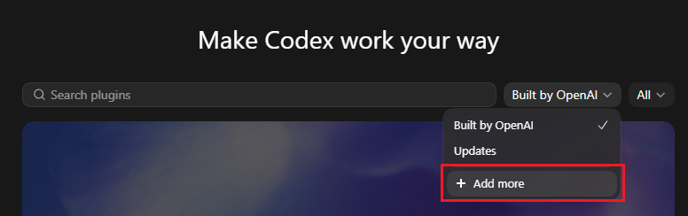
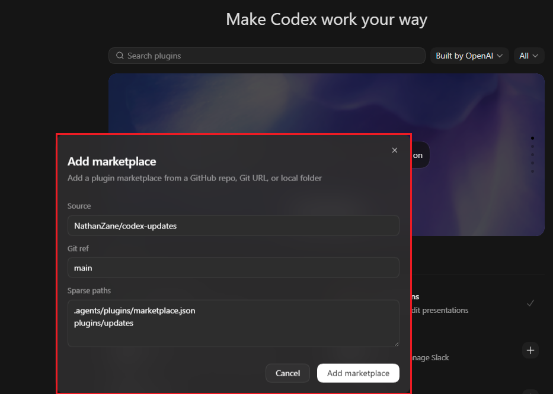
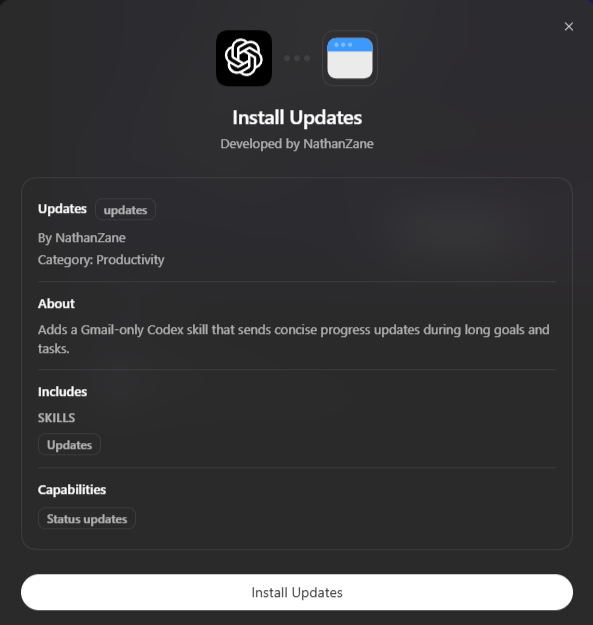
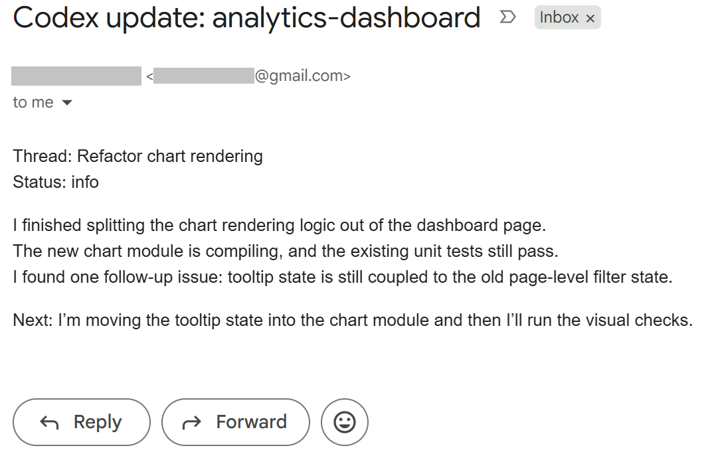
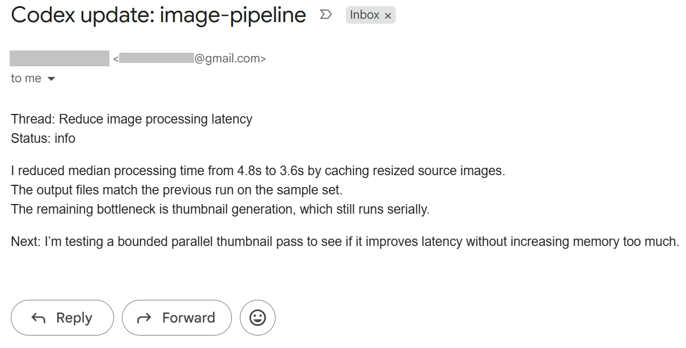

# Updates

Updates is a Codex plugin that sends short progress emails during long-running Codex work.

It currently uses Gmail only. When requested, Codex sends updates to the authenticated Gmail account itself and does not read, search, archive, delete, label, forward, or inspect existing email.

## Install From Codex

In Codex, open Plugins, click the add button, and choose **Add marketplace**.



Use these fields:

```text
Source: NathanZane/codex-updates
Git ref: main
Sparse paths:
.agents/plugins/marketplace.json
plugins/updates
```



Then install the **Updates** plugin from the added marketplace.



## Setup

Connect Gmail in Codex before using the plugin.

After installing, restart Codex or start a fresh thread so the `$updates` skill is loaded.

## Test

Ask Codex:

```text
Use $updates. Send a test progress update for this thread.
```

## Usage

Tell Codex to `use $updates` when starting long-running work.

```text
Use $updates during this goal.
```

By default, Codex sends important updates when useful and avoids sending routine updates more often than every 30 minutes. The skill also tells Codex to keep track of the task start time and last update time while working.

You can also specify different behavior:

```text
Use $updates every 15 minutes.
```

```text
Use $updates whenever you improve performance by 1%.
```

```text
Use $updates when you're done with the refactor of the `utils` folder.
```

```text
Use $updates whenever you've resolved a finding.
```

Timing requests are approximate. This plugin currently uses a Codex skill, not an enforced background timer, so Codex checks whether to send an update when it regains control after substantial steps or tool calls.

Expected email format:

- Subject: `Codex update: <exact project name>`
- Body: short plain text with `Status`, `Thread`, and `Next`
- Recipient: the authenticated Gmail account

Example update emails:




